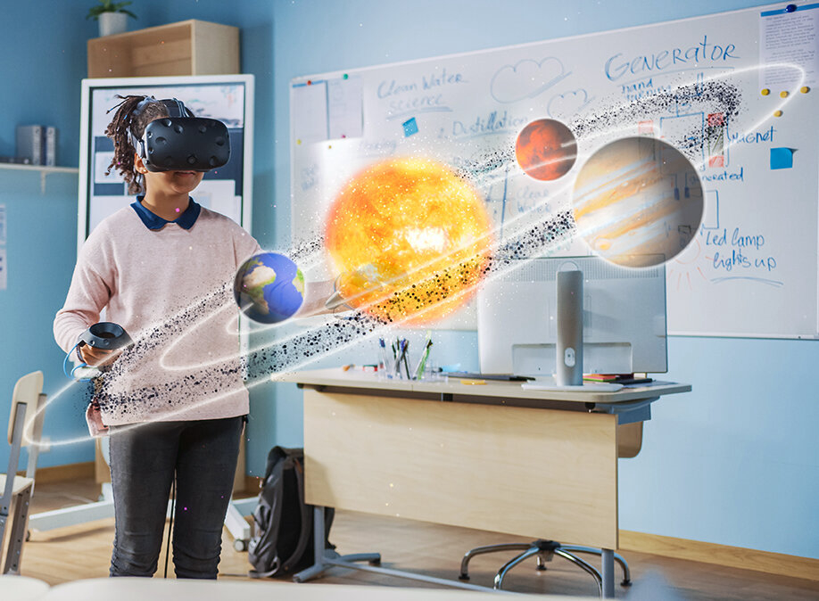

# Intro — XR Immersion

— source: [nextwavestem.com](https://nextwavestem.com/stem-resources-news/stem-resources-and-news/artificial-intelligence-for-kids-all-you-need-to-know)

XR is immersive because it creates realistic and believable worlds that blur boundaries between the real and the digital world.
