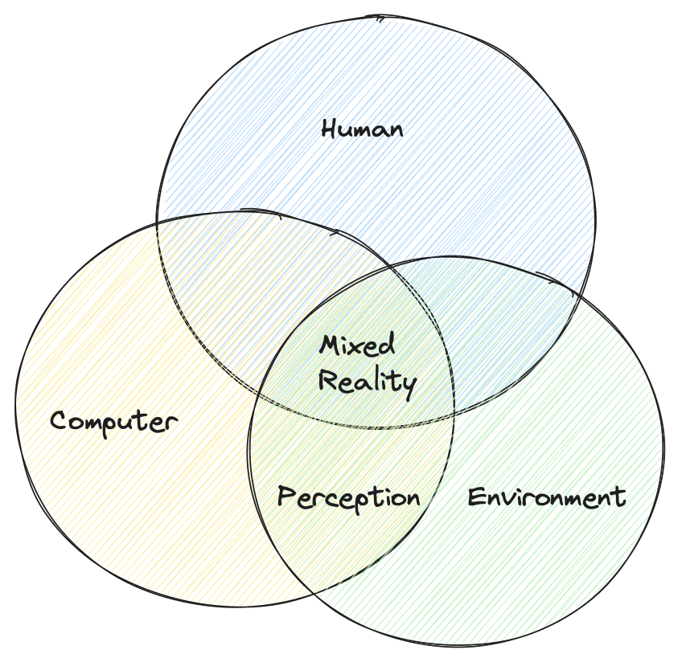

# Intro — XR Interaction

XR is characterized as human-computer-environment interaction.

- Human understanding: capturing human interactions and input, including, position, hand-tracking, eye-tracking, and speech

<!---->

- Environment understanding: mapping and anchoring of spaces, surfaces, locations, and objects
- Computer processing: sensing, rendering, and keeping track of both human and environment
