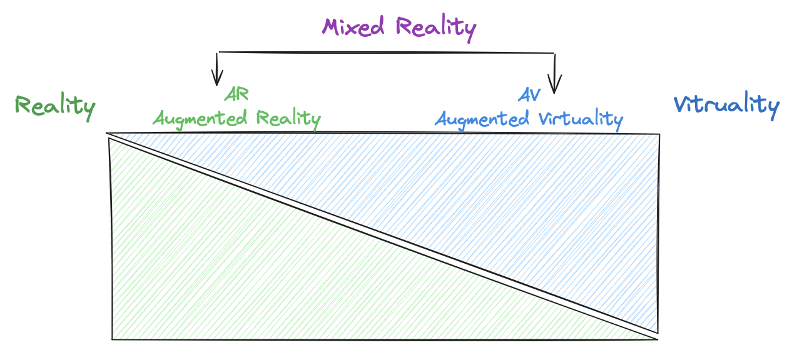

# Intro — XR realities spectrum

XR is an umbrella term that includes three types of realities: **_augmented reality_** (AR), **_virtual reality_** (VR), and **_mixed reality_** (MR). We often get asked what’s the difference between these three realities. There is a subtle difference between these technologies. However, the field of XR is still developing and boundaries are a bit blurred.

In the following sections, we will define in a bit more detail, each type of reality. But here are some condensed definitions:

- AR: Layers virtual content over a user’s real environment
- VR: Simulates a self-contained virtual environment around the user
- MR: Blends virtual and user’s real environment with interaction between both

:::excalidraw{data='{&quot;data&quot;:[],&quot;files&quot;:{}}'}
:::
