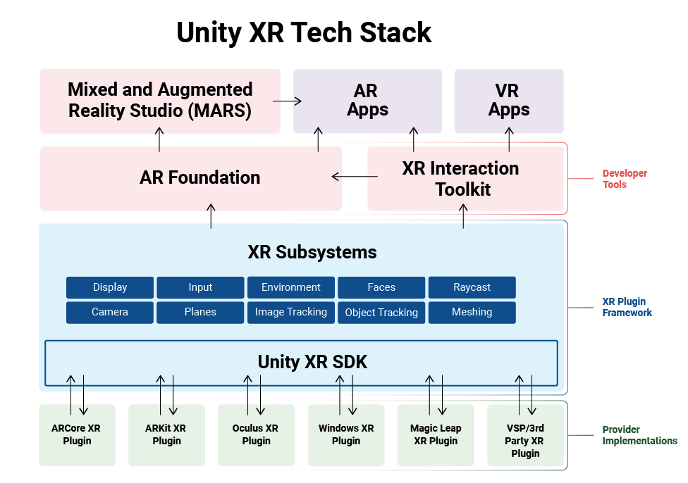

# Introduction to XR

**Objectives**

- Define AR, VR, XR

- Explain the difference between
  - marker-based XR
  - marker-less XR
  - gps-based XR
  - plane-based XR
  - head-worn XR
  - hand-held XR

- Identify practical uses cases for AR and VR

## What is XR?

XR is an emerging technology (aka. spatial computing) that:

- Blends physical and digital worlds
- Create multimodal, spatial, and immersive experiences and applications

XR is multimodal because it blends visual, haptic, auditory interactions that are realistic, as far as possible.

XR is also spatial because most interactions are anchored in physical and/or virtual spaces and environments.

And finally, XR is immersive because it create realistic and believable worlds that blur boundaries between the real and the digital world.

As an emerging technology, XR has it’s own toolsets that is worth learning and mastering.

## XR is spectrum of three realities

XR is an umbrella term that includes three types of realities: **_augmented reality_** (AR), **_virutal reality_** (VR), and **_mixed reality_** (MR). We often get asked what’s the difference between theses three realities. There is a subtle difference between these technologies. However, the field of XR is still developping and boundaries are a bit blured.

In the following sections, we will define in a bit more detail, each type of reality. But here are some condensed definitions:

- AR: Layers virtual content over a user’s real environment
- VR: Simulates a self-contained virtual environnment around the user
- MR: Blends virtual and user’s real environment with interaction between both

## XR interaction

XR is charachterized as human-computer-environment interaction.

- Human understanding: capturing human interactions and input, inclusing, position, hand-tracking, eye-tracking, and speech

<!---->

- Environment understanding: mapping and anchoring of spaces, surfaces, locations, and objects
- Computer processing: sensing, rendering and keeping track of both human and environment

## XR Architecture

## **XR provider plugins (plugin framework)**

**XR Plug-in Management plugin in unity editor** is the main entry points.

They provide basics for XR dev in unity, in particular, abstractions to design cross platforms applications

## Developer tools (aka. support packages)

Package build on XR plugin framework to add application-level features and developers tools

# AR

AR involves a new set of design challenges compared to VR or 3D applications. AR aims to overlay virtual content over real world environment around a user. To do so, we should dertermine what and when to places virtual objects depending on the information received from users’ device (camera) and update the scene accordingly, in real time. This typically includes, detecting objects in a scene, such as vertical planes, like walls, floors, horizontal surfaces like tables, as well as locations, people, faces, among others. AR application process such information in realtime to create a user experience.

## AR Scenes

Most objec of AR scene are not 3D objects rather GameObject added at runtime and created as prefabs.
