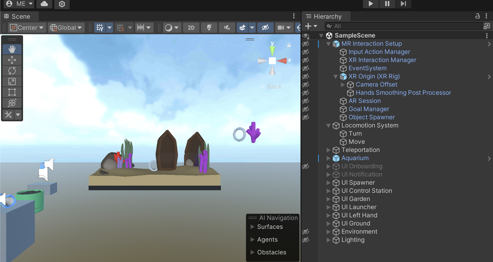

# Unity Scene

The building blocks of any Unity app are **GameObjects.** Unity represents **GameObjects** in a three-dimensional space. In XR applications, the scene may also include objects representing the environment, such as floor, ceiling, wall, etc.

- In Unity, a scene is a top level object of an app that we create inside a project and add **GameObjects** to it.\*\*\*\*
- We open a scene in \*\*\*\*the **Hierarchy**. And, we inspect GameObjects in the **inspector.** Scene objects have the Unity logo icon.
- A scene is the main entry point of an application. When we deploy a Unity application, we deploy a scene that includes all the GameObjects of the application.
- A Unity app can have multiple scenes.

