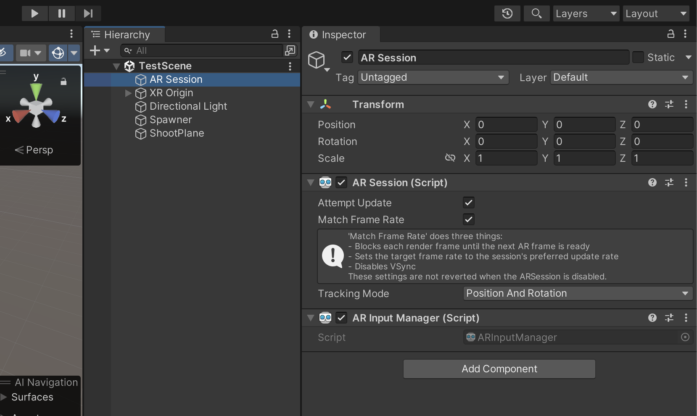
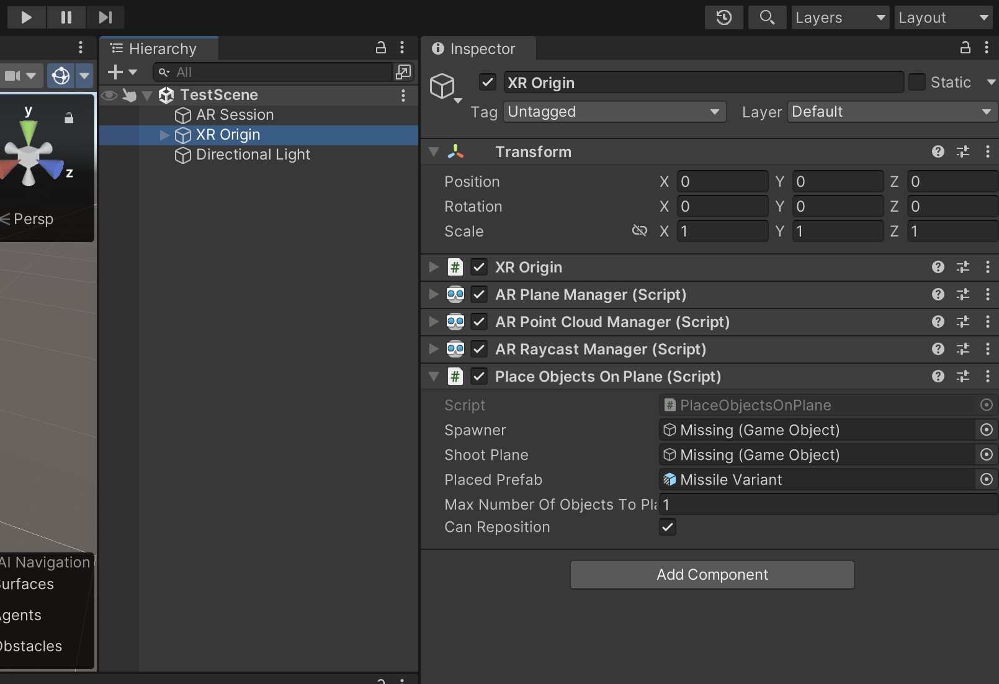
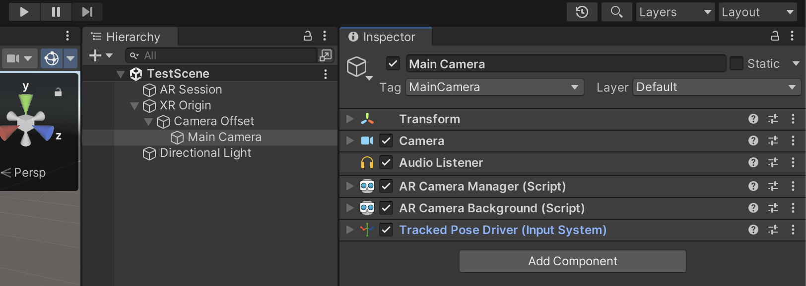

# Unity XR — Core Concepts

## AR Session

Manager of XR session. It enables or disables XR on the target device.

## XR Origin

Manager of objects and tracking features in the scene. It processes, computes, and updates objects’ position, orientation, and scale — on the movement of the camera (player or device).

## Camera

Camera: Player’s viewport in an XR scene.

