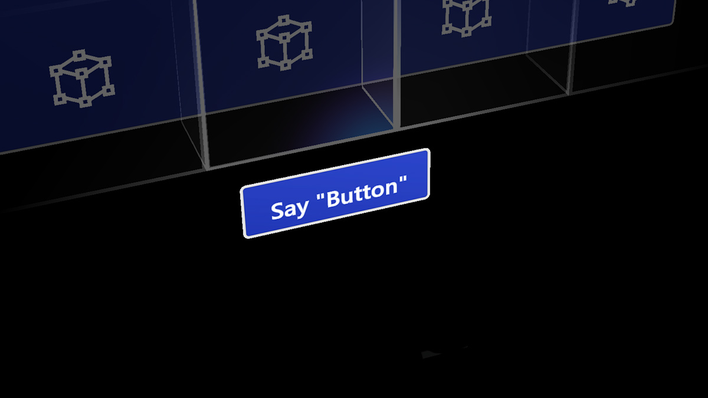

# XR Interaction — Voice Interaction

— source: [learn.microsoft.com/en-us/windows/mixed-reality](https://learn.microsoft.com/en-us/windows/mixed-reality)

This model is part of the

XR Hand-free model

. This can be seen as a "_see it, say it_" interaction where the user can interact with objects and elements of the scene by talking out loud. Similar to

XR Point and Commit

, the head or the Gaze (see

XR Gaze-based Interaction

) is the means to target objects. Some interactions might not require targeting.

Voice interaction might not be practical in louder conditions.
